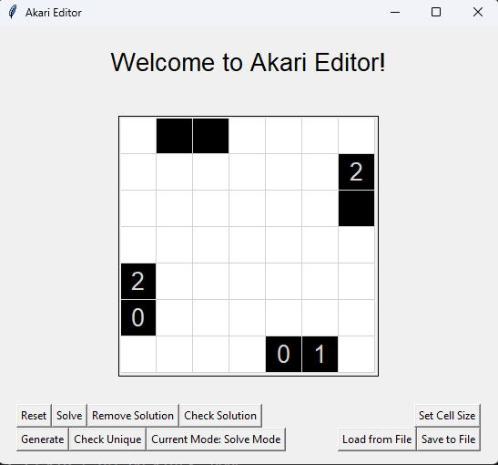

# Akari Solver/Creator - Assignment 3

This repo contains my code for assignment 3 for CSCI 539 - CSP Solver/Creator



## Functions

This program has two modes:

- Creator
- Solver

You can use the program to create Akari puzzles, store them in files, and solve them. It also implements a solving algorithm that you can use to solve any Akari puzzle, and a generating algorithm to randomly create a new Akari puzzle with a difficulty level from 1-3.

## How to run

To run this code, launch guiAkariCreator.py like

```bash
python3 guiAkariCreator.py -f /puzzles/light_up_online/normal/394015
```

-f is an option you can use to load up a file automatically